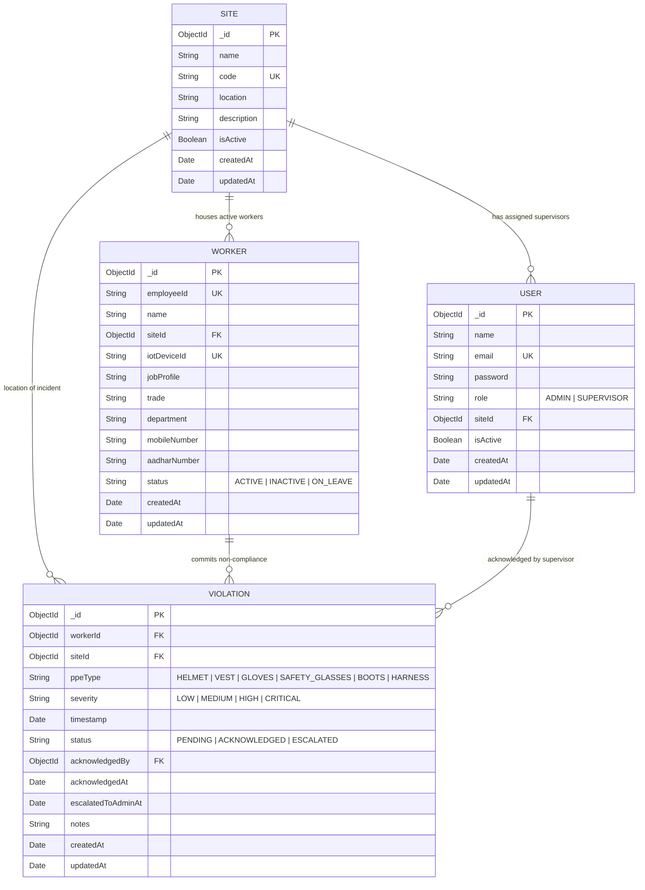

# Database Schema & Data Models

This document outlines the database structure, entity relationships, index configurations, and dataset ingestion logic used in the Workforce Management System.

---

## 1. Entity-Relationship Diagram

---

## 2. Collections Overview

### `sites`
Represents physical construction sites, manufacturing plants, or infrastructure projects.

| Field | Type | Attributes | Description |
| :--- | :--- | :--- | :--- |
| `_id` | `ObjectId` | PK | Primary identifier |
| `name` | `String` | required, unique, trim | Full site name |
| `code` | `String` | required, unique, uppercase | Short site code (e.g. APEX-01) |
| `location` | `String` | required, trim | City or sector location |
| `description` | `String` | trim | Project description |
| `isActive` | `Boolean` | default: true | Active status |
| `timestamps` | `Date` | auto | Created / Updated timestamps |

---

### `users`
Stores user credentials and roles for Admins and Supervisors.

| Field | Type | Attributes | Description |
| :--- | :--- | :--- | :--- |
| `_id` | `ObjectId` | PK | User ID |
| `name` | `String` | required, trim | User full name |
| `email` | `String` | required, unique, lowercase | Login email address |
| `password` | `String` | required, select: false | Bcrypt hashed password |
| `role` | `String` | enum: ['ADMIN', 'SUPERVISOR'] | Access level |
| `siteId` | `ObjectId` | ref: 'Site', default: null | Assigned site (Supervisors only) |
| `isActive` | `Boolean` | default: true | Account active flag |
| `timestamps` | `Date` | auto | Created / Updated timestamps |

---

### `workers`
Stores field worker profiles imported from `workers_dataset.xlsx`.

| Field | Type | Attributes | Description |
| :--- | :--- | :--- | :--- |
| `_id` | `ObjectId` | PK | Worker ID |
| `employeeId` | `String` | required, unique, uppercase | Worker employee code |
| `name` | `String` | required, trim | Worker name |
| `siteId` | `ObjectId` | ref: 'Site', required | Current site assignment |
| `iotDeviceId` | `String` | required, unique | Paired IoT hardware ID |
| `jobProfile` | `String` | trim | Job designation |
| `trade` | `String` | trim | Skill trade category |
| `department` | `String` | trim | Department |
| `mobileNumber` | `String` | trim | Phone number |
| `aadharNumber` | `String` | trim | Identity number |
| `status` | `String` | enum: ['ACTIVE', 'INACTIVE', 'ON_LEAVE'] | Employment status |
| `timestamps` | `Date` | auto | Created / Updated timestamps |

**Indexes**:
- `{ siteId: 1 }`: Fast queries for site-specific workers.

---

### `violations`
Logs PPE non-compliance incidents sent by worker IoT devices or simulated.

| Field | Type | Attributes | Description |
| :--- | :--- | :--- | :--- |
| `_id` | `ObjectId` | PK | Incident ID |
| `workerId` | `ObjectId` | ref: 'Worker', required | Offending worker |
| `siteId` | `ObjectId` | ref: 'Site', required | Site location |
| `ppeType` | `String` | enum: HELMET, VEST, GLOVES, SAFETY_GLASSES, BOOTS, HARNESS | Missing PPE equipment |
| `severity` | `String` | enum: LOW, MEDIUM, HIGH, CRITICAL | Risk severity level |
| `timestamp` | `Date` | required, default: Date.now | Incident occurrence time |
| `status` | `String` | enum: PENDING, ACKNOWLEDGED, ESCALATED | Current status |
| `acknowledgedBy` | `ObjectId` | ref: 'User', default: null | Supervisor who acknowledged |
| `acknowledgedAt` | `Date` | default: null | Acknowledgment timestamp |
| `escalatedToAdminAt` | `Date` | default: null | Auto-escalation timestamp |
| `notes` | `String` | trim | Resolution or event notes |
| `timestamps` | `Date` | auto | Created / Updated timestamps |

**Indexes**:
- `{ status: 1, timestamp: 1 }`: Optimizes the 10-minute escalation background scanner querying pending incidents.
- `{ siteId: 1, timestamp: -1 }`: Speeds up supervisor site views.
- `{ ppeType: 1, timestamp: -1 }`: Supports analytics aggregations by PPE type.
- `{ workerId: 1, timestamp: -1 }`: Fast lookup of incident history per worker.

---

## 3. Data Seeding Pipeline

The `backend/src/seeders/seed.js` script handles data population:
1. Parses `backend/data/workers_dataset.xlsx` using the `xlsx` library.
2. Creates default sites and user accounts (`ADMIN` and `SUPERVISOR`).
3. Maps Excel rows into `Worker` documents and generates matching IoT device IDs (`IOT-WRK0001`).
4. Injects initial violation records across various states (`PENDING`, `ACKNOWLEDGED`, `ESCALATED`) so dashboard charts render meaningful data immediately.
