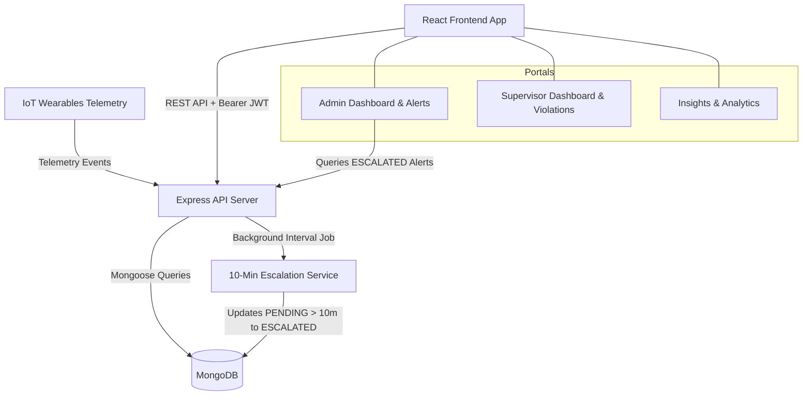
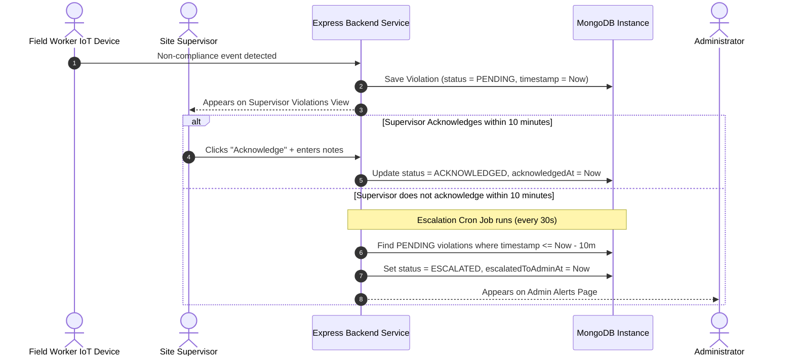

# System Architecture & Design Documentation

## System Architecture

The application uses a decoupled client-server architecture. The frontend is built with React 19 and Vite, talking to a Node.js / Express backend backed by MongoDB.

---

## The 10-Minute Alert Escalation Workflow

### How the Workflow Operates

1. **Detection**: An IoT device or simulation triggers a non-compliance event (e.g. missing helmet or harness).
2. **Supervisor Queue**: The incident immediately appears on the assigned supervisor's Violations page with a status of `PENDING`.
3. **Acknowledgment**:
   - If the supervisor acknowledges the incident within 10 minutes, the status updates to `ACKNOWLEDGED`.
   - If the incident remains unacknowledged for 10 minutes, the background escalation job updates its status to `ESCALATED`.
4. **Admin Escalation**: Escalated incidents are displayed on the Admin Alerts page for executive oversight.

---

## Role-Based Access Control (RBAC) Matrix

| Feature / Action | Admin | Supervisor | Public |
| :--- | :---: | :---: | :---: |
| Auth / Login | Yes | Yes | Yes |
| Admin Dashboard & Metrics | Yes | No | No |
| Supervisor Management | Yes | No | No |
| Admin Alerts Page | Yes | No | No |
| Data Insights & Charts | Yes | No | No |
| Supervisor Dashboard | Yes | Yes | No |
| Site Violations List | Yes | Yes | No |
| Acknowledge Violation | Yes | Yes | No |
| Export CSV Report | Yes | Yes | No |
| Trigger Simulation Event | Yes | Yes | No |

---

## Key Implementation Details

1. **Background Escalation Job**: A `setInterval` job in `server.js` executes `EscalationService.checkAndEscalateViolations()` every 30 seconds. It updates `PENDING` records older than 10 minutes using `updateMany()`, which keeps database IO efficient.
2. **Dataset Import**: The `seed.js` script reads `workers_dataset.xlsx` using SheetJS (`xlsx`), maps each row to a `Worker` document, assigns site links, and sets up matching initial data.
3. **Frontend Role Routing**: `ProtectedRoute.jsx` checks the user's role stored in `AuthContext` to prevent unauthorized client route access.
