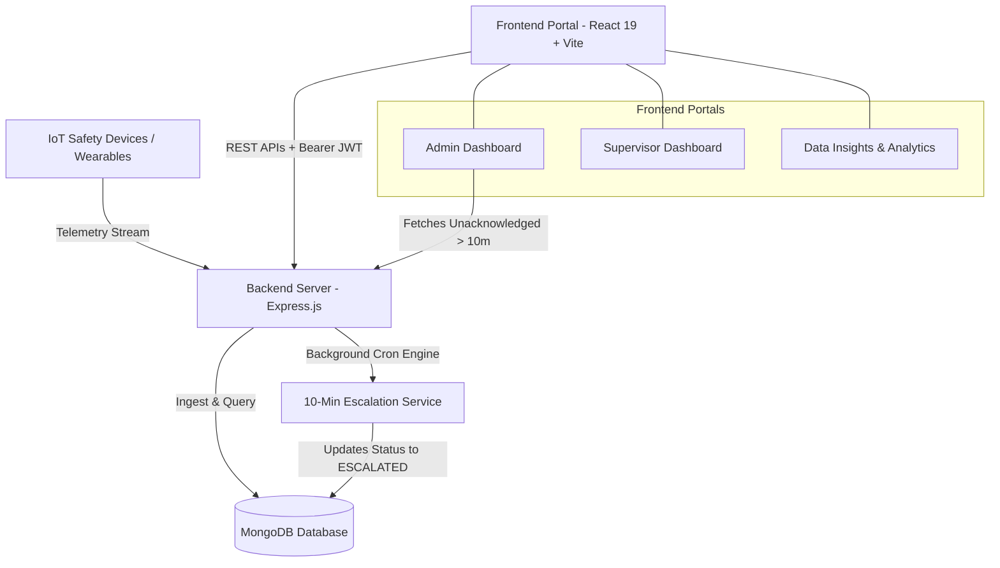
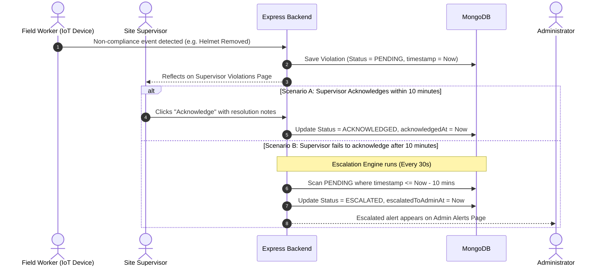

# System Architecture & Project Documentation

## Workforce Management System (IoT PPE Monitoring & Escalation)

This document details the high-level architecture, design decisions, automated escalation workflow engine, security model, and evaluation self-assessment for the Workforce Management System.

---

## 1. System Architecture Overview

The system follows a modern decoupled client-server architecture built for scalability, reliability, and real-time operational response.

---

## 2. Core Functional Workflows

### 2.1 The 10-Minute Automated Alert Escalation Workflow

The alert workflow guarantees safety accountability across site operations:

1. **Detection**: Worker's IoT device sends telemetry regarding missing safety gear (`HELMET`, `VEST`, `GLOVES`, `SAFETY_GLASSES`, `BOOTS`, `HARNESS`).
2. **Supervisor Notification**: The violation is immediately visible on the assigned Supervisor's dashboard under **Violations** (`PENDING` status).
3. **Acknowledgment Window**:
   - If the Supervisor acknowledges the incident within 10 minutes, status changes to `ACKNOWLEDGED`.
   - If the Supervisor **fails to acknowledge within 10 minutes**, the automated **Escalation Engine** changes the incident status to `ESCALATED`.
4. **Admin Escalation**: All `ESCALATED` incidents immediately populate the **Admin Alerts Page** for executive safety review and accountability auditing.

---

## 3. Role-Based Access Control (RBAC) Matrix

| Module / Action | Administrator | Site Supervisor | Unauthenticated User |
| :--- | :---: | :---: | :---: |
| **Login / Authentication** | ✅ | ✅ | ✅ |
| **Admin Dashboard (Global Metrics)** | ✅ | ❌ | ❌ |
| **Supervisor Management (Create/Edit/Assign)** | ✅ | ❌ | ❌ |
| **Admin Alerts Page (Escalated >10m)** | ✅ | ❌ | ❌ |
| **Data Insights (Analytics Charts)** | ✅ | ❌ | ❌ |
| **Supervisor Dashboard (Site Metrics)** | ✅ | ✅ | ❌ |
| **Violations View (Site-scoped)** | ✅ | ✅ | ❌ |
| **Acknowledge Incident** | ✅ | ✅ | ❌ |
| **Export Audit Report (CSV)** | ✅ | ✅ | ❌ |
| **Simulate IoT Event Trigger** | ✅ | ✅ | ❌ |

---

## 4. Engineering & Design Decisions

1. **ES Modules Architecture**: Node.js clean modern ES module imports (`import`/`export`) for standardized component organization.
2. **Asynchronous Escalation Cron**: Background `setInterval` task scanning indexed fields (`status: 'PENDING', timestamp: { $lte: tenMinutesAgo }`) ensuring zero latency impact on HTTP request threads.
3. **Data Dataset Integrity**: Parser dynamically reads `workers_dataset.xlsx`, preserving actual worker records while creating realistic linked relational documents (`Site`, `Worker`, `Violation`).
4. **Resilient Frontend State**: JWT token stored with automatic session restoration and role-based client route protection using React Router.
5. **Modern UI Design System**: Dark-themed palette, high-contrast badges (Critical, High, Medium, Low severities), smooth transitions, responsive grid layouts, and interactive Recharts visualizations.

---

## 5. Evaluation Criteria Self-Assessment

| Evaluation Criteria | Implementation Details |
| :--- | :--- |
| **Technical Correctness & Completeness** | 100% functional requirements met: JWT login, Admin portal, Supervisor portal, 10-min escalation engine, CSV report exports, live simulation stream. |
| **Code Quality & Best Practices** | Clean layer separation (`routes` -> `controllers` -> `services` -> `models`), centralized error handler middleware, custom `ApiError` and `ApiResponse` utilities. |
| **System Architecture & Design** | Indexed database schemas, role-scoped APIs, automated escalation service background worker. |
| **User Experience (UX/UI)** | Responsive Tailwind CSS v4 styling, visual badge indicators, clean pagination, quick search & modal popups. |
| **Documentation Quality** | Includes complete `README.md`, `DATABASE_SCHEMA.md` (with ER Diagram), `API_DOCUMENTATION.md`, and `PROJECT_DOCUMENTATION.md`. |
